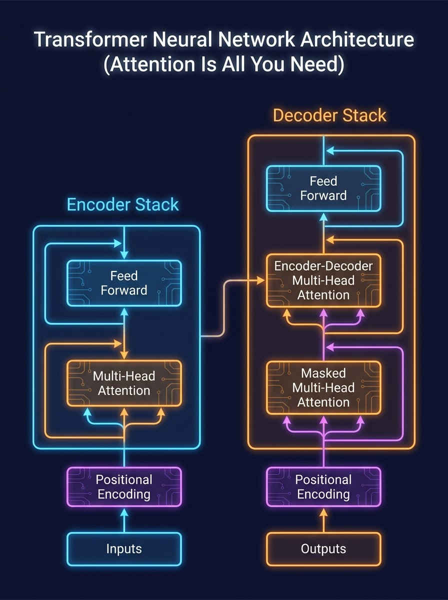
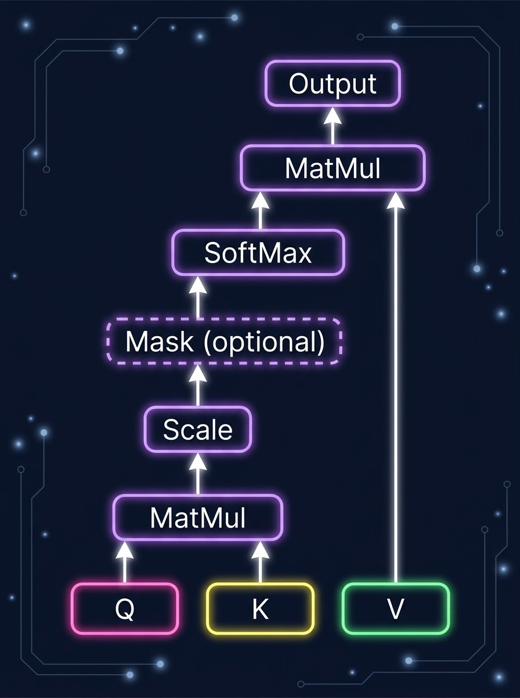
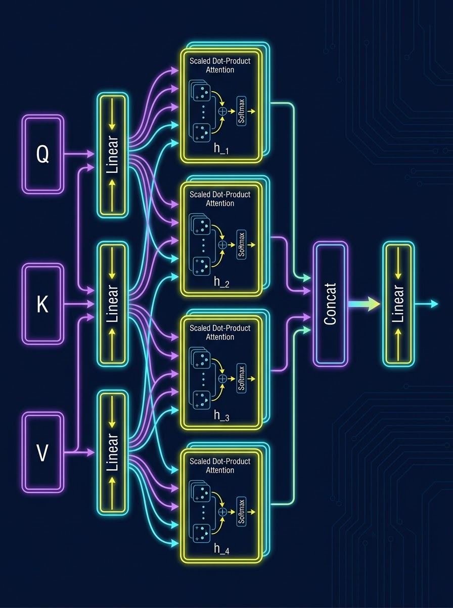

# No, Attention Is NOT "All" You Need... But It’s About 99% Of It: The Ultimate Beginner's Deep-Dive Guide to the Transformer

So, you’ve finally decided to open the holy grail of modern deep learning. The 2017 paper that killed recurrent networks, made LSTMs look like pocket calculators, and birthed every "GPT" and "Claude" currently writing people’s emails: **"Attention Is All You Need"** by Vaswani et al. [1].

Maybe you’re reading this on Day 1 of your research paper journey. If so, congratulations! You’ve picked the absolute perfect place to start. But if you’re staring at the math, the encoder-decoder blocks, and the mysterious sinusoidal equations thinking, *"What on earth is a Query, Key, and Value?"*—don't panic. 

Today, we are going to deconstruct the Transformer from the absolute ground up. We are going to explain it using the ultimate, drama-filled analogies: **an over-dramatic high school group chat, a chaotic dating app, and screaming into a microphone**. 

But we won't skip the math either! We will walk through a **concrete step-by-step numerical toy example** of how a word actually calculates its attention.

Let’s dive in.

---

## 🚀 The Transformer Master Blueprint

Before we dive into how the individual gears turn, let’s look at the complete factory blueprint of the Transformer. This diagram is your map for the rest of this guide.

  
   
  <b>Figure 1: The Full Transformer Model Architecture. Left is the Encoder Stack, right is the Decoder Stack.</b>

The Transformer is built on an **Encoder-Decoder** framework [8]:
1.  **The Encoder (Left Stack):** Takes the input sequence (e.g., *"Attention is all you need"*), processes it in parallel, and converts it into a rich map of contextual meanings [9].
2.  **The Decoder (Right Stack):** Takes the Encoder's map and generates the translated output sequence (e.g., *"L'attention est tout ce dont vous avez besoin"*) **auto-regressively**—meaning it predicts one word at a time, feeding its own previous words back into itself to predict the next one [8, 10].

Both stacks are made of $N = 6$ identical layers stacked on top of each other [9, 10]. 

---

## 1. The Pre-2017 Era: The Tragedy of Old AI

Before the Transformer, if you wanted to do Neural Machine Translation (NMT) or process language, you had two main choices: **Recurrent Neural Networks (RNNs/LSTMs)** [12, 11] or **Convolutional Neural Networks (CNNs)** [8]. Both had massive, glaring structural flaws.

### The RNN Problem: A Highly Forgetful Game of "Telephone"
RNNs and LSTMs process language sequentially—one word at a time [4]. 

Imagine trying to translate a 50-word sentence. The model reads Word 1, generates a hidden state, passes it to Word 2, generates another hidden state, and so on [4]. 
*   **The Sequential Computation Bottleneck:** Because Word 2 cannot be processed until Word 1 is finished, you cannot parallelize your training [4]. If you have 8 state-of-the-art GPUs sitting in your server room, they are basically twiddling their thumbs waiting in a single-file line [1, 27].
*   **The Amnesia Problem:** By the time the RNN gets to Word 50, it has already forgotten what Word 1 was [11]. The forward and backward signals have to traverse a path length that grows linearly ($O(n)$) with the sequence length [20]. This makes learning long-range dependencies incredibly hard [23]. It’s like trying to remember if you locked your front door while trying to solve a calculus equation on a unicycle.

### The CNN Problem: The Hyper-Local Block Club
Some researchers tried using CNNs (like ByteNet or ConvS2S) to process tokens in parallel [15, 8]. This solved the parallelization issue, but introduced a new one:
*   A CNN is like a neighborhood where you can only talk to your immediate neighbors. To connect distant words in a sentence, you needed to stack multiple convolutional layers [25].
*   The number of operations required to relate signals from two arbitrary positions grew either linearly ($O(n)$) or logarithmically ($O(\log(n))$) with distance [6]. This meant the message had to climb through a massive pyramid of convolutional layers just to get from Word 1 to Word 100, making long-range dependencies difficult to capture [6, 23].

---

## 2. Welcome to the Ultimate Group Chat (Self-Attention)

The authors of "Attention Is All You Need" asked a radical question: **What if we throw away recurrence and convolutions entirely?** [1]

Instead of a sequential "telephone" chain, let’s dump all the words of a sentence into a **hyperactive, dramatic high school Discord group chat**. In this group chat, every word is allowed to "ping" and look at every other word simultaneously. This is **Self-Attention** [7].

Let's say we have the word **"bank"** in two different group chats:

1.  *"I sat by the river **bank**."*
2.  *"I deposited my cash in the **bank**."*

In a traditional RNN, "bank" has to wait its turn. In the Transformer's group chat, **"bank"** instantly sends a broad ping to everyone else: *"Who here is relevant to me?"*

*   In Sentence 1, the word **"river"** replies immediately. The model registers a strong attention weight between "bank" and "river," establishing that "bank" refers to land [7].
*   In Sentence 2, the words **"cash"** and **"deposited"** shout back. The model attends to them, understanding that "bank" now refers to a financial institution [7].

By allowing direct, instant connections between all words, the maximum path length between any two tokens is always **$O(1)$** [20]. Long-range dependencies are no longer a nightmare; they are the default [23].

---

## 3. The Math: Queries, Keys, Values, and Tinder

How does this group chat work mathematically? The paper introduces **Scaled Dot-Product Attention** [11].

  
   
  <b>Figure 2: The Scaled Dot-Product Attention Engine.</b>

To build a flawless intuition, let's use a **Dating App (like Tinder)** analogy:
*   **Query ($Q$):** What you are looking for (e.g., *"Looking for a software engineer who loves dogs"*).
*   **Key ($K$):** The profile headers of everyone on the app (e.g., *"Dog lover / PyTorch fan"*, *"Loves hiking / No tech"*).
*   **Value ($V$):** The actual person behind the profile. When you find a Key that matches your Query, you get access to their full conversational Value!

### The Formula
For a matrix of Queries ($Q$), Keys ($K$), and Values ($V$), the attention is calculated as [12]:

$$\text{Attention}(Q, K, V) = \text{softmax}\left(\frac{QK^T}{\sqrt{d_k}}\right)V$$

---

## 🧮 Let's Do the Math: A Toy Numerical Example

To make this crystal clear, let’s calculate attention manually for a simple 3-word sentence: **"Love is all."**

Suppose our model has a dimension size of $d_{\text{model}} = 4$ (real Transformers use $d_{\text{model}} = 512$, but we have bills to pay and brains to save [9]).

Let's represent our 3 words as simple vectors of size $4$:
*   **"Love"** = $[1.0, 0.0, 1.0, 0.0]$
*   **"is"** = $[0.0, 1.0, 0.0, 1.0]$
*   **"all"** = $[1.0, 1.0, 0.0, 0.0]$

These vectors are packed into our input matrix $X$ of size $(3, 4)$:

$$X = \begin{bmatrix} 1.0 & 0.0 & 1.0 & 0.0 \\ 0.0 & 1.0 & 0.0 & 1.0 \\ 1.0 & 1.0 & 0.0 & 0.0 \end{bmatrix}$$

### Step 1: Project to Q, K, and V
To get our Queries ($Q$), Keys ($K$), and Values ($V$), we multiply our input $X$ by three learned weight matrices: $W^Q$, $W^K$, and $W^V$ [14, 16]. Let's assume for this example that our key dimension $d_k$ is $3$.

Suppose our learned weights are:

$$W^Q = \begin{bmatrix} 1 & 0 & 1 \\ 0 & 1 & 0 \\ 1 & 0 & 0 \\ 0 & 1 & 1 \end{bmatrix}, \quad W^K = \begin{bmatrix} 0 & 1 & 0 \\ 1 & 0 & 1 \\ 0 & 1 & 1 \\ 1 & 0 & 0 \end{bmatrix}, \quad W^V = \begin{bmatrix} 0.5 & 0.0 \\ 0.0 & 1.0 \\ 0.5 & 0.5 \\ 0.0 & 0.0 \end{bmatrix}$$

Now we multiply $X$ by these weight matrices:

$$Q = X \cdot W^Q = \begin{bmatrix} 1.0 & 0.0 & 1.0 & 0.0 \\ 0.0 & 1.0 & 0.0 & 1.0 \\ 1.0 & 1.0 & 0.0 & 0.0 \end{bmatrix} \cdot \begin{bmatrix} 1 & 0 & 1 \\ 0 & 1 & 0 \\ 1 & 0 & 0 \\ 0 & 1 & 1 \end{bmatrix} = \begin{bmatrix} 2.0 & 0.0 & 1.0 \\ 0.0 & 2.0 & 1.0 \\ 1.0 & 1.0 & 1.0 \end{bmatrix}$$

$$K = X \cdot W^K = \begin{bmatrix} 0.0 & 2.0 & 1.0 \\ 2.0 & 0.0 & 1.0 \\ 1.0 & 1.0 & 1.0 \end{bmatrix}$$

$$V = X \cdot W^V = \begin{bmatrix} 1.0 & 0.5 \\ 0.0 & 1.0 \\ 0.5 & 1.0 \end{bmatrix}$$

---

### Step 2: Compute the Similarity Scores ($Q K^T$)
Now we multiply $Q$ by the transpose of $K$ ($K^T$) to see how much each word relates to every other word [12].

$$Q K^T = \begin{bmatrix} 2.0 & 0.0 & 1.0 \\ 0.0 & 2.0 & 1.0 \\ 1.0 & 1.0 & 1.0 \end{bmatrix} \cdot \begin{bmatrix} 0.0 & 2.0 & 1.0 \\ 2.0 & 0.0 & 1.0 \\ 1.0 & 1.0 & 1.0 \end{bmatrix} = \begin{bmatrix} 1.0 & 5.0 & 3.0 \\ 5.0 & 1.0 & 3.0 \\ 3.0 & 3.0 & 3.0 \end{bmatrix}$$

Look at the matrix! The score of "Love" (Row 1) attending to "is" (Column 2) is a whopping **$5.0$**, indicating a very high affinity.

---

### Step 3: Scale Down (Don't Blow the Speakers!)
Why do we divide by the square root of the key dimension ($d_k$)? 
*   **The Analogy:** Imagine you are screaming into a microphone. If you scream too loudly, the audio clips, distorts, and sounds like static.
*   As the dimension size $d_k$ gets larger, the magnitude of the dot products grows extremely large [14]. This pushes the softmax function into flat, high-magnitude regions where the gradients become microscopic (vanishing gradients) [14].
*   Dividing by $\sqrt{d_k}$ acts as a volume dial, pulling the dot products back into a stable region so the model can actually learn [14, 15].

Since $d_k = 3$, we divide our scores by $\sqrt{3} \approx 1.73$:

$$\frac{QK^T}{\sqrt{d_k}} \approx \begin{bmatrix} 0.58 & 2.89 & 1.73 \\ 2.89 & 0.58 & 1.73 \\ 1.73 & 1.73 & 1.73 \end{bmatrix}$$

---

### Step 4: Apply Softmax (The Spotlight of Attention)
The softmax function converts these raw, scaled scores into probability weights that sum to $1.0$ along each row [12]. It highlights the most important words while dimming the irrelevant ones.

$$\text{softmax}\left(\frac{QK^T}{\sqrt{d_k}}\right) = \begin{bmatrix} 0.08 & 0.73 & 0.19 \\ 0.73 & 0.08 & 0.19 \\ 0.33 & 0.33 & 0.33 \end{bmatrix}$$

Notice how in the first row ("Love"), the spotlight of attention is focused on the second word "is" ($73\%$ of the attention)!

---

### Step 5: Multiply by the Value Matrix ($V$)
Finally, we multiply our attention weights by our Values ($V$) to get our final output representations [11, 12]:

$$\text{Output} = \begin{bmatrix} 0.08 & 0.73 & 0.19 \\ 0.73 & 0.08 & 0.19 \\ 0.33 & 0.33 & 0.33 \end{bmatrix} \cdot \begin{bmatrix} 1.0 & 0.5 \\ 0.0 & 1.0 \\ 0.5 & 1.0 \end{bmatrix} = \begin{bmatrix} 0.18 & 0.96 \\ 0.83 & 0.64 \\ 0.50 & 0.83 \end{bmatrix}$$

We have successfully computed the contextualized representation of our words! Instead of static dictionary vectors, every word now carries a mixture of the meaning of the words around it.

---

## 🧠 Multi-Head Attention: The Specialized Gossip Squad

If you only use a single attention head over your full $512$-dimensional space, the model will struggle. Averaging all the attention weights together tends to dilute the signal—it's like having a single, stressed-out student trying to track every piece of drama in the group chat at once [6, 15].

To fix this, the authors introduced **Multi-Head Attention** [6, 14].

  
   
  <b>Figure 3: Multi-Head Attention Running h = 8 Parallel Heads.</b>

Instead of doing attention once with $d_{\text{model}} = 512$, we project queries, keys, and values **$h = 8$ times** using learned linear weights to lower-dimensional spaces where $d_k = d_v = 64$ [16].

On each of these projected versions, we perform Scaled Dot-Product Attention in parallel [14]. Finally, we concatenate the 8 outputs and project them back to $d_{\text{model}} = 512$ [14, 16].

### The Analogy: Dividing the Labor
This is like dividing the group chat analysis among **8 highly specialized gossip-agents**:
*   **Head 1 (The Grammar Cop):** Focuses strictly on syntax (*"Which verb belongs to this noun?"*).
*   **Head 2 (The Pronoun Detective):** Focuses on coreference resolution (*"Who does the word 'it' refer to?"*).
*   **Head 3 (The Action Tracker):** Focuses on temporal relationships (*"When did this event happen?"*).

Because each head is operating in a lower-dimensional subspace ($64$ dimensions), **the total computational cost is identical to single-head attention with full dimensionality**, but the representational power is exponentially greater [15, 16]!

---

## 🛠️ The Safety Rails: Residual Connections & Layer Norm

If you look closely at the architecture diagram (Figure 1), you’ll see that every attention block and feed-forward block is followed by a step labeled **"Add & Norm"** [9, 10]. This is the unsung hero that prevents deep networks from collapsing during training.

### 1. Residual Connections (The "High-Speed Highway")
As neural networks get deeper, they suffer from the **vanishing gradient problem**: during backpropagation, gradients are multiplied backwards through layers, and if they are small, they shrink exponentially until they hit zero, completely stopping the model from learning.

A **Residual Connection** (modeled as $x + \text{Sublayer}(x)$) solves this by building a parallel, direct highway around each block [9]. 
*   **The Analogy:** It’s like a manager saying, *"Give me your creative ideas, but keep a copy of your original notes just in case your creative idea is a total mess."*
*   Gradients can flow back along this highway completely unimpeded, allowing networks to be stacked dozens of layers deep without exploding or vanishing.

### 2. Layer Normalization (The "Standardization Officer")
After adding the original input to the output of the block, we apply **Layer Normalization** [9]:

$$\text{Output} = \text{LayerNorm}(x + \text{Sublayer}(x))$$

Layer normalization calculates the mean and variance of all features for a single token's representation and scales them to have a mean of $0$ and a standard deviation of $1$ [1]. 
*   **The Analogy:** It’s like a strict editor who enforces a standardized style. No matter how wild and eccentric a particular word's values become, Layer Norm reels them in, keeping the numerical representations within a safe, stable range.

---

## 🕰️ Reintroducing Time: Positional Encodings

Since the Transformer processes all words simultaneously, it is completely order-blind [19]. To the self-attention mechanism, *"Dog eats homework"* and *"Homework eats dog"* look exactly the same.

To give the model spatial awareness, the authors add **Positional Encodings** to the input embeddings at the bottom of the stacks [19, 20].

The paper utilizes **fixed sinusoidal (sine and cosine) functions**:

$$\text{PE}_{(pos, 2i)} = \sin\left(\frac{pos}{10000^{2i/d_{\text{model}}}}\right)$$
$$\text{PE}_{(pos, 2i+1)} = \cos\left(\frac{pos}{10000^{2i/d_{\text{model}}}}\right)$$

Where $pos$ is the token position and $i$ is the vector dimension index [21].

### Why Sines and Cosines?
1.  **Relative Distance Learning:** Due to trigonometric identities, for any fixed offset $k$, $\text{PE}_{pos+k}$ can be represented as a linear function of $\text{PE}_{pos}$ [21]. This makes it incredibly easy for the model to learn to attend to relative positions [21].
2.  **Extrapolation to Infinite Length:** Unlike learned positional embeddings (which fail if the model encounters a sequence longer than any seen during training), these continuous wave functions can generate unique coordinate values for a sequence of *any* arbitrary length [21].

---

## 👩‍🍳 The Secret Training Recipe

Building a Transformer is only half the battle; training it without it exploding is the other half. The paper lays out a very specific recipe:

*   **Optimizer:** Adam optimizer with $\beta_1 = 0.9$, $\beta_2 = 0.98$, and $\epsilon = 10^{-9}$ [27].
*   **The Learning Rate Scheduler:** The learning rate is varied dynamically throughout training [27]. It increases linearly for the first $warmup\_steps = 4000$, and then decreases proportionally to the inverse square root of the step number [28]:
    $$\text{lrate} = d_{\text{model}}^{-0.5} \cdot \min(\text{step\_num}^{-0.5}, \text{step\_num} \cdot \text{warmup\_steps}^{-1.5})$$
*   **Regularization Tricks:**
    *   **Residual Dropout:** A dropout rate of $P_{drop} = 0.1$ is applied to the output of each sub-layer before addition and normalization, as well as to the summed embeddings and positional encodings [28].
    *   **Label Smoothing:** They employed a label smoothing factor of $\epsilon_{ls} = 0.1$ [30]. This intentionally forces the model to be slightly unsure of its predictions, which hurts perplexity but ultimately boosts accuracy and BLEU scores [30].

---

## 🏆 Empirical Triumph: Breaking the Benchmarks

To prove that this new architecture wasn't just a theoretical gimmick, the authors put it to the test on the WMT 2014 translation datasets—and absolutely blew past the state of the art [30].

| Model | EN-DE BLEU | EN-FR BLEU | Training Cost (FLOPs) |
|---|---|---|---|
| **GNMT + RL (Prior SOTA)** [31] | 24.6 | 39.92 | $2.3 \times 10^{19}$ |
| **ConvS2S Ensemble** [8] | 26.36 | **41.29** | $7.7 \times 10^{19}$ |
| **Transformer (base)** [29] | 27.3 | 38.1 | **$3.3 \times 10^{18}$** (Fraction of SOTA cost!) |
| **Transformer (big)** [30] | **28.4** | 41.0 | $2.3 \times 10^{19}$ |

*   **The Base Model:** Even the base model surpassed almost all previously published models and ensembles at a **mere fraction** of the computational training cost [30].
*   **The Big Model:** Established a new state-of-the-art BLEU score of **28.4** on English-to-German, outperforming the previous best ensemble by over 2.0 BLEU [30].
*   **Training Time:** The English-to-French model trained for just 3.5 days on 8 NVIDIA P100 GPUs—a small sliver of the training costs of prior systems [1, 27].

---

## Conclusion: A Paradigm Shift

"Attention Is All You Need" proved that recurrence and convolutions are not necessary for sequence modeling [1, 36]. By replacing them entirely with multi-head self-attention, the Transformer unlocked:
1.  Constant path lengths for long-range dependency learning [20, 23].
2.  Massive parallelization during training [1, 5].
3.  Unprecedented efficiency and translation quality [1].

The next time you write a prompt for an AI, remember: under the hood, there is a massive, incredibly fast, multi-headed group chat running, tracking who is talking to whom, and doing it all in parallel.

***

### References
*   [1] Vaswani, A., et al. "Attention Is All You Need." NIPS 2017.
*   [4] Hochreiter, S., & Schmidhuber, J. "Long Short-Term Memory." 1997.
*   [6] Kalchbrenner, N., et al. "Neural Machine Translation in Linear Time." 2016.
*   [8] Gehring, J., et al. "Convolutional Sequence to Sequence Learning." 2017.
*   [11] Bahdanau, D., et al. "Neural Machine Translation by Jointly Learning to Align and Translate." 2014.
*   [20] Kaiser, L., & Sutskever, I. "Neural GPUs Learn Algorithms." 2016.
